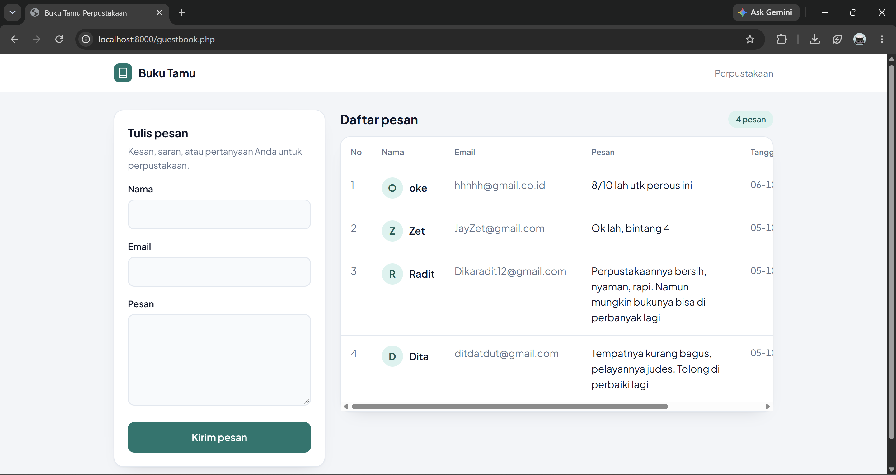
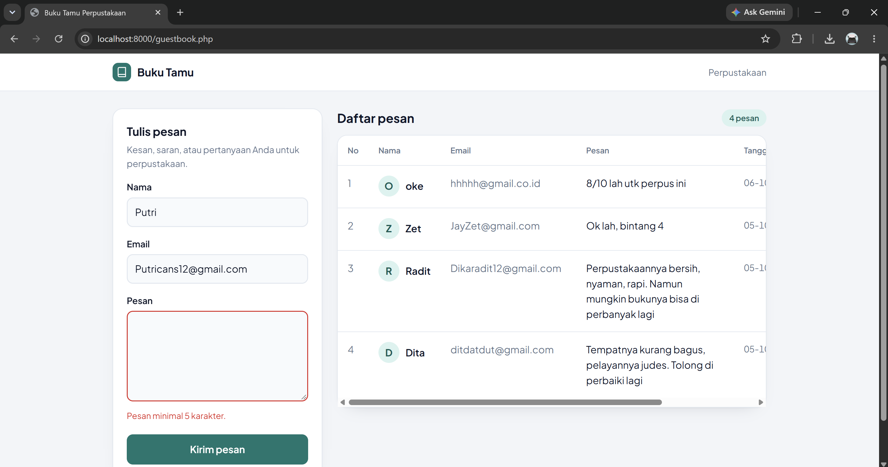
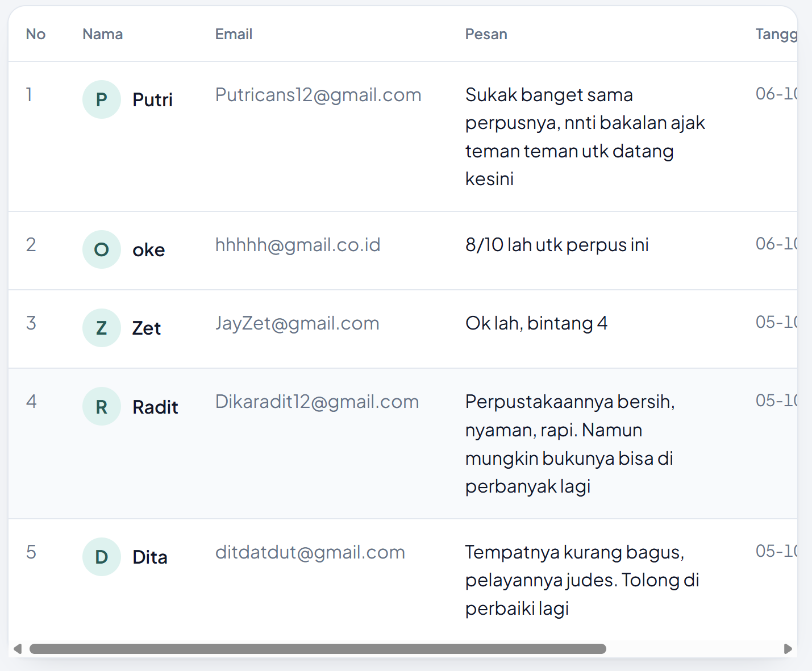
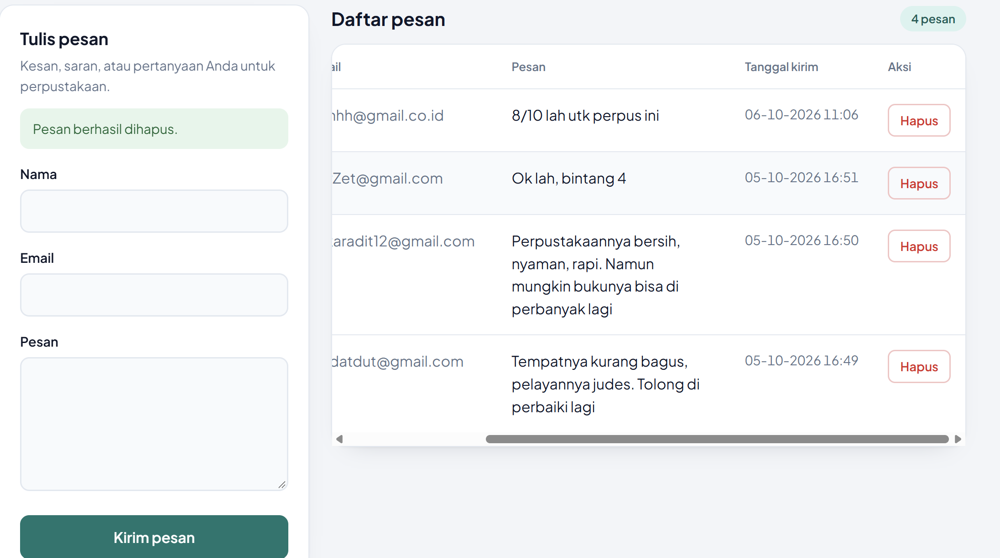
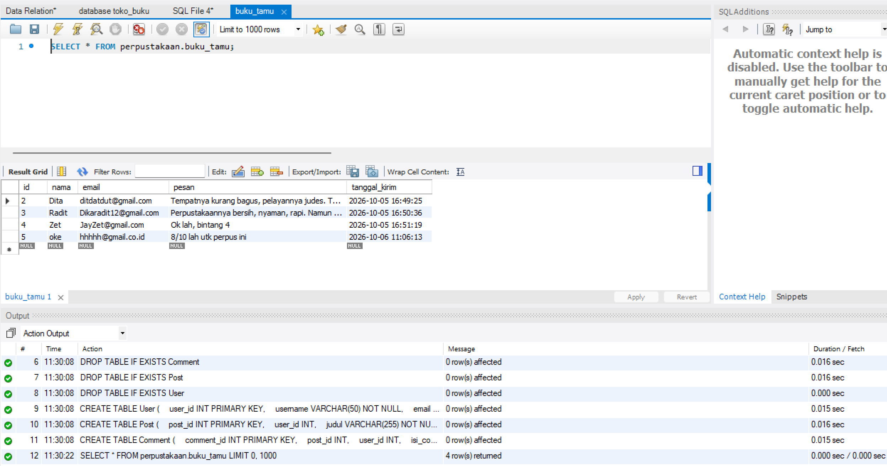

# Modul Buku Tamu Perpustakaan (PHP + PDO)

Tugas Mandiri Modul 7, Pemrograman Web.

- **Nama:** Heniel Putri Tangko Ramba Padang
- **NIM:** D121241044

## Deskripsi

Modul buku tamu digital untuk perpustakaan. Pengunjung menulis pesan lewat formulir, pesan disimpan ke basis data MySQL melalui PDO, lalu daftar pesan ditampilkan dalam tabel di halaman yang sama. Halaman juga menyediakan tombol hapus untuk tiap pesan (fitur tambahan di luar spesifikasi).

## Struktur Tabel `buku_tamu`

| Kolom | Tipe | Keterangan |
|---|---|---|
| `id` | INT UNSIGNED, AUTO_INCREMENT | Primary key |
| `nama` | VARCHAR(100), NOT NULL | Nama pengirim |
| `email` | VARCHAR(100), NOT NULL | Email pengirim |
| `pesan` | TEXT, NOT NULL | Isi pesan |
| `tanggal_kirim` | DATETIME, NOT NULL | Terisi otomatis (`CURRENT_TIMESTAMP`) |

Skema lengkap ada di `schema.sql`.

## Validasi Masukan

- Nama tidak boleh kosong (maksimal 100 karakter).
- Email harus berformat valid (`FILTER_VALIDATE_EMAIL`, maksimal 100 karakter).
- Pesan minimal 5 karakter (maksimal 1000 karakter).

Validasi dilakukan di sisi server oleh method `GuestBook::validasi()`. Isian yang sudah diketik tetap tampil saat ada galat.

## Fitur Keamanan (Pertahanan Ganda)

| Lapisan | Penerapan | Melindungi dari |
|---|---|---|
| Prepared statements | Query `INSERT`, `SELECT`, dan `DELETE` memakai placeholder (`:nama`, `:email`, `:pesan`, `:id`, `:batas`) dan `PDO::ATTR_EMULATE_PREPARES => false` | SQL Injection |
| Token CSRF | Token acak dari `random_bytes(32)` disimpan di session, dikirim lewat input hidden, dan dicocokkan dengan `hash_equals()`. Token diganti setelah aksi berhasil | Cross-Site Request Forgery |
| Sanitasi keluaran | Semua data dari basis data ditampilkan lewat fungsi `e()` yang membungkus `htmlspecialchars()` | Cross-Site Scripting (XSS) |
| Validasi masukan | Pemeriksaan di server sebelum data disimpan | Data tidak valid |
| Post/Redirect/Get | Halaman dialihkan setelah form berhasil dikirim | Pengiriman ganda saat refresh |

Fitur hapus memakai metode POST dengan token CSRF, dan `id` divalidasi sebagai bilangan bulat positif sebelum dipakai.

## Menjalankan

1. Impor `schema.sql` ke MySQL (phpMyAdmin: tab **Import**, atau MySQL Workbench: **File → Open SQL Script**, lalu Execute). Skrip ini aman dijalankan ulang.
2. Dari folder proyek, jalankan server bawaan PHP:
   ```
   php -S localhost:8000
   ```
3. Buka `http://localhost:8000/guestbook.php` di browser.

Koneksi bawaan: host `localhost`, database `perpustakaan`, user `root`, tanpa password (sesuai XAMPP standar). Jika pengaturan MySQL berbeda, atur lewat variabel lingkungan `DB_HOST`, `DB_NAME`, `DB_USER`, dan `DB_PASS`. Contoh di PowerShell:

```powershell
$env:DB_PASS = "password-mysql-anda"
php -S localhost:8000
```

Kebutuhan: PHP 8.0 atau lebih baru dengan ekstensi `pdo_mysql`, serta MySQL 5.7 atau lebih baru.

## Tangkapan Layar

Gambar disimpan di folder `screenshots/`.

### Halaman utama


### Galat validasi


### Daftar pesan di tabel


### Konfirmasi dan hasil hapus


### Data tersimpan di basis data


## Catatan

- `GuestBook.php` berada di dalam folder `classes` karena namanya hanya berbeda huruf besar-kecil dari `guestbook.php`, sehingga keduanya tidak bisa berada di folder yang sama di Windows dan macOS.
- Halaman ini belum memiliki login, sehingga siapa pun yang membukanya dapat menghapus pesan. Pada aplikasi sungguhan, fitur hapus sebaiknya dibatasi untuk admin.
- Berkas yang diwajibkan tugas adalah `GuestBook.php` dan `guestbook.php`. `schema.sql` dan `README.md` adalah berkas tambahan.

## Referensi

- Claude (Anthropic), asisten AI yang digunakan untuk membantu merancang struktur kode, menjelaskan konsep keamanan, dan menyusun dokumentasi. Seluruh kode telah dibaca, diuji, dan dipahami oleh penulis.